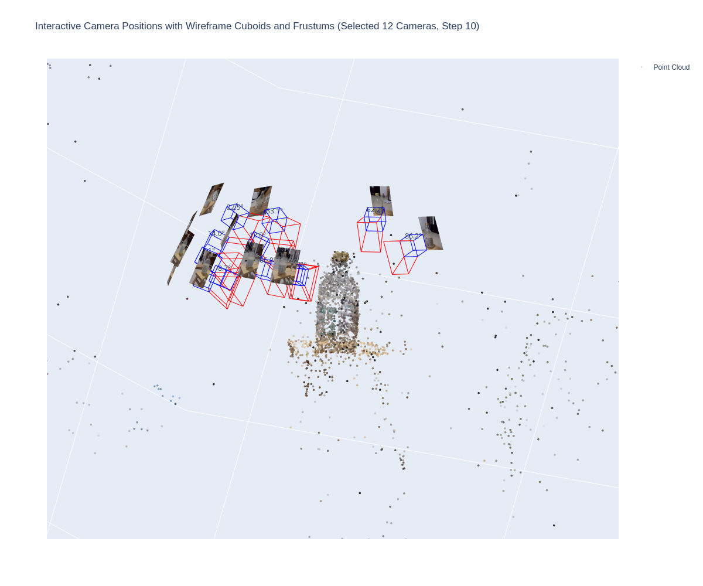
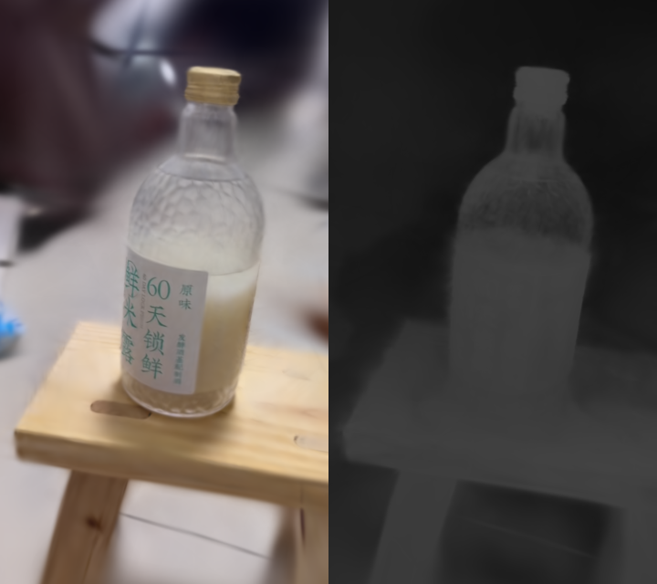

# Quick Start

## Download data 
download data from `https://drive.google.com/file/d/1NH7ZPm7Ufi0Q5_dBgECEA2qHcr5FXTu4/view?usp=sharing`

```bash
mkdir -p ./data
tar -zxvf test_colmap.tar.gz -C ./data
```

download source code 

```bash 
git clone git@github.com:GauthierLi/3DGaussianSpatting_for_beginer.git
cd 3DGaussianSpatting_for_beginer
git submodule update --init --recursive
```

## Interactive visualization dataset
run with following code
```python
python vis_dataset.py
```


## Train 

run following commands to run code and install related packages
```bash 
python train.py --install --mode train
```
reconstruct images:


## TODOs 
- [x] visualization dataset
- [x] train process
- [ ] save and interactive with trained Gaussian Splatting models
- [ ] validation process
- [ ] migrate to base trainer

## 📈 Progress

<p align="center">
    <a href="https://star-history.com/#GauthierLi/3DGaussianSpatting_for_beginer&Date">
    
  </a>
</p>
